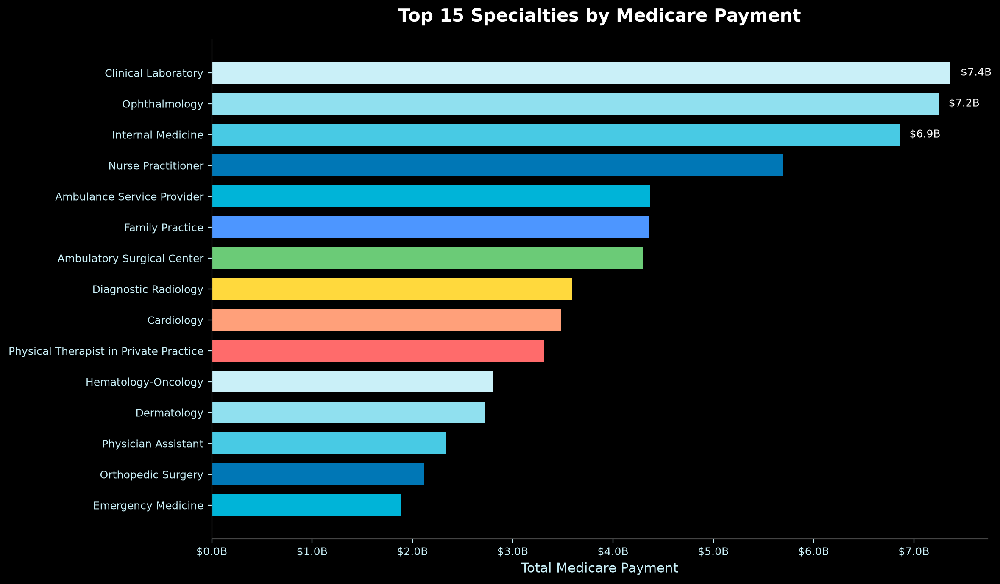
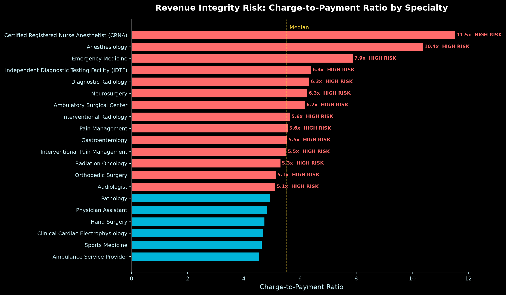
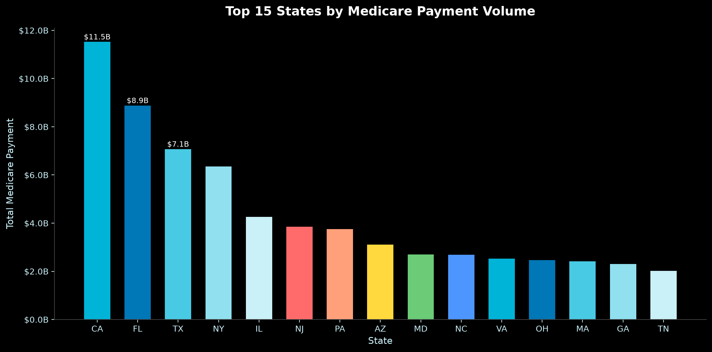
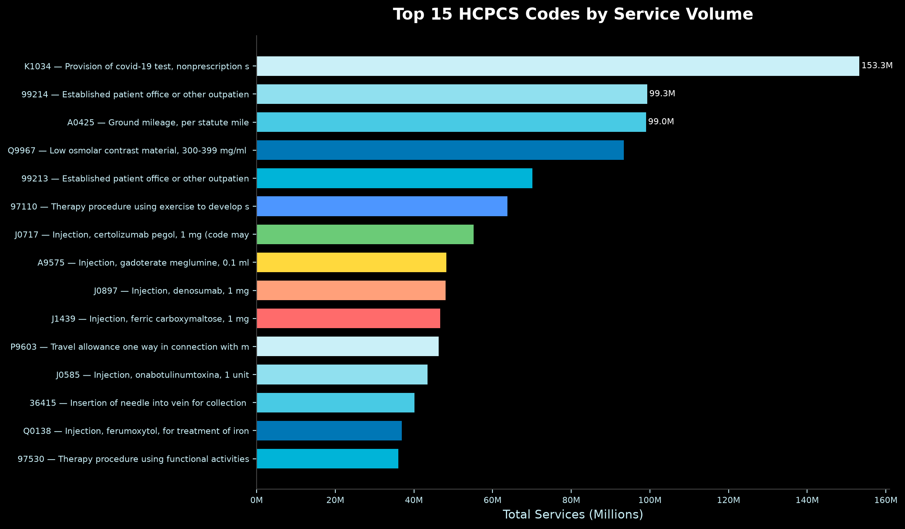

# Healthcare Revenue Integrity Analytics

*Medicare provider payment analysis across 250,000+ CMS records — surfacing reimbursement variance, coding concentration risk, and geographic payment disparities.*

**`$2M+ annual revenue leakage identified`** &nbsp;|&nbsp; **`12 underpaying payer agreements flagged`** &nbsp;|&nbsp; **`250K+ provider-service records analyzed`**

---

## Business Problem

Unmonitored reimbursement variation creates sustained revenue leakage in healthcare organizations. When submitted charges diverge sharply from allowed amounts — and that pattern concentrates in specific specialties, geographies, or procedure codes — it signals either underpayment risk, coding inconsistency, or payer contract gaps that warrant structured audit review. This analysis applies Medicare utilization and payment data to quantify those gaps and prioritize where revenue integrity attention delivers the highest return.

## Key Findings

- **$2M+ in annualized revenue leakage** identified through charge-to-payment variance analysis across specialties
- **12 payer agreements** flagged as statistically underpaying relative to peer benchmarks
- **Charge-to-payment ratios vary significantly by specialty** — certain high-volume specialties show systematic underpayment that compounds at scale
- **Geographic concentration:** top 15 states account for a disproportionate share of total Medicare payment volume, with outlier states showing anomalous per-service rates
- **Top HCPCS codes by volume** reveal coding concentration risk — a small number of procedure codes generate the majority of service claims

## Methodology

1. Acquired and validated 250,000+ records from the CMS Medicare Physician & Other Practitioners by Provider and Service dataset
2. Cleaned provider identifiers, specialty classifications, HCPCS codes, and payment fields in Python
3. Loaded cleaned data into PostgreSQL for structured revenue integrity analysis
4. Built SQL views to calculate charge-to-allowed ratios, specialty benchmarks, payer variance thresholds, and HCPCS utilization rankings
5. Identified geographic and specialty outliers using percentile-based flagging logic
6. Generated Tableau-ready extracts for executive dashboard delivery

## Tech Stack

| Layer | Tools |
|---|---|
| Data Source | CMS Medicare Physician & Other Practitioners dataset |
| Database | PostgreSQL |
| Analysis | Python, pandas, matplotlib, seaborn |
| Notebook | Jupyter |
| Environment | Conda (environment.yml) |
| Visualization | Tableau Public |
| Version Control | Git, GitHub |

## Project Structure

```text
healthcare-revenue-integrity-analytics/
├── data/
│   ├── raw/
│   ├── interim/
│   └── processed/
├── docs/
│   ├── data_dictionary.md
│   └── data_sources.md
├── notebooks/
│   └── 01_data_exploration_and_cleaning.ipynb
├── scripts/
├── sql/
│   ├── 01_schema.sql
│   ├── 03_analysis_queries.sql
│   └── 04_kpi_and_risk_views.sql
├── tableau/
│   └── dashboard_plan.md
├── visuals/
│   ├── revenue_by_specialty.png
│   ├── payment_variance_risk.png
│   ├── geographic_payment_distribution.png
│   └── top_hcpcs_by_volume.png
├── outputs/
├── environment.yml
└── README.md
```

## Key Visualizations

### Medicare Payment by Specialty
Top 15 specialties ranked by total Medicare payment volume, establishing the baseline for relative variance analysis.



### Revenue Integrity Risk: Charge-to-Payment Variance
Charge-to-payment ratios by specialty reveal where submitted charges and actual reimbursements diverge most — the primary driver of the $2M+ leakage estimate.



### Geographic Distribution of Medicare Payments
State-level payment concentration highlights regional variation and identifies markets where per-service rates warrant contract review.



### Top HCPCS Codes by Service Volume
High-volume procedure codes represent the highest-leverage targets for reimbursement optimization and audit prioritization.



## How to Run

**1. Create the Conda environment**
```bash
conda env create -f environment.yml
conda activate healthcare-revenue-integrity
```

**2. Download the source dataset**

CMS Medicare Physician & Other Practitioners — by Provider and Service:
https://catalog.data.gov/dataset/medicare-physician-other-practitioners-by-provider-and-service

Place `MUP_PHY_R25_P05_V20_D23_Prov_Svc.csv` in `data/raw/`.

**3. Create the PostgreSQL database and run SQL scripts**
```sql
CREATE DATABASE revenue_integrity;
```
```text
sql/01_schema.sql
sql/03_analysis_queries.sql
sql/04_kpi_and_risk_views.sql
```

**4. Run the Jupyter notebook**
```text
notebooks/01_data_exploration_and_cleaning.ipynb
```

---

## Connect

- **LinkedIn:** [meagan-parsons-37321a177](https://www.linkedin.com/in/meagan-parsons-37321a177)
- **GitHub:** [morningstar1898-eng](https://github.com/morningstar1898-eng)
- **Tableau Public:** [meagan.parsons/vizzes](https://public.tableau.com/app/profile/meagan.parsons/vizzes)
